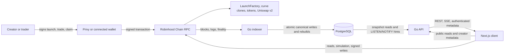

# Launchpad

Launchpad is a non-custodial, fixed-supply token launchpad for Robinhood Chain. A creator
launches a token through the on-chain factory; users trade it against an integer bonding curve;
once the curve reaches its configured threshold, the curve closes and its launch liquidity moves
to a Uniswap v2 pair. The initial LP position is sent to the fixed burn address. Wallets sign
their own transactions. Contracts hold and account for on-chain assets; the Go backend indexes
chain data and serves reads but never holds user trading funds or signs trades.

This repository contains Solidity contracts, a Go indexer and API backed by PostgreSQL, a
Next.js web client, deterministic local Anvil end-to-end gates, deployment tooling, and their
specifications and operating runbooks. A working build or green local test gate is not a live
deployment, external security audit, production approval, or evidence of live Robinhood/Privy
acceptance.

## Contents

- [Project status and release boundary](#project-status-and-release-boundary)
- [Token lifecycle and v1 economics](#token-lifecycle-and-v1-economics)
- [System architecture and data flow](#system-architecture-and-data-flow)
- [Repository map](#repository-map)
- [Supported product surfaces](#supported-product-surfaces)
- [Architecture and security invariants](#architecture-and-security-invariants)
- [Prerequisites](#prerequisites)
- [Setup](#setup)
- [Quick start: frontend-only development](#quick-start-frontend-only-development)
- [Full local Anvil end-to-end gate](#full-local-anvil-end-to-end-gate)
- [Configuration reference](#configuration-reference)
- [Database migrations](#database-migrations)
- [Verification commands](#verification-commands)
- [Deployment, testnet, and production](#deployment-testnet-and-production)
- [Operations, health, and reorg recovery](#operations-health-and-reorg-recovery)
- [Documentation map](#documentation-map)
- [Current active backlog](#current-active-backlog)
- [Troubleshooting](#troubleshooting)

## Project status and release boundary

The checkout's active development branch is `dev`. `main` contains milestone PR #7 at
`37fb6ee`. Task-level implementation work is normally linear on `dev`, while a
short-lived `task/<slug>` branch is reserved for unusually large or uncertain high-risk work.
See [AGENTS.md](AGENTS.md) for the working and Git handoff rules.

| Area                                                 | Repository status                                                               | What that status does not establish                                                       |
| ---------------------------------------------------- | ------------------------------------------------------------------------------- | ----------------------------------------------------------------------------------------- |
| Contract Foundations, Tasks 1–12                     | Complete                                                                        | An external audit or production authorization                                             |
| Backend Foundations, Tasks 1–12                      | Complete                                                                        | A running hosted service                                                                  |
| Backend Indexer, Plan 2, Tasks 1–5                   | Implementation, deterministic gates, and reviewed chain-46630 manifest complete | Live testnet product acceptance                                                           |
| API and identity, Plan 3, Tasks 1–7                  | Implementation complete                                                         | A configured production Privy organization or hosted API                                  |
| Web client, Plan 4, Tasks 1–8                        | Implementation and deterministic CI gates complete on `dev`                     | A live release, hosted API, configured Privy application, or production acceptance        |
| Full codebase audit and hardening, Plan 5, Tasks 1–8 | Repository remediation and available deterministic gates complete on `dev`      | A new Slither detector run, archive-RPC fork run, external audit, or production readiness |

The reviewed Robinhood Chain Testnet dependency and Launchpad manifests are active. Deployment
receipts, runtime bytecode hashes, and LaunchFactory configuration were verified, but the first
live product acceptance run with separate creator and trader wallets remains open. The
production runbook still has external inputs to be supplied by the product, infrastructure,
security, Privy, and governance owners. Current open work is listed under
[Current active backlog](#current-active-backlog) and in [backlog.md](backlog.md).

The source-selection decision for optional ETH/USD enrichment is documented, but the runtime
provider adapter, production key, timestamps, and UI attribution are not implemented. ETH-native
amounts, quotes, and execution remain authoritative. The Forum/Memestock surface has no route,
API, or canonical data model and is a later product plan. The Plan 5 closeout and exclusions are
recorded in [the audit dossier](docs/audits/plan-5/README.md); that dossier is an internal code
audit record, not an independent external audit.

## Token lifecycle and v1 economics

### Launch and configuration snapshot

The creator calls `LaunchFactory` from their wallet. The factory charges the configured launch
fee, creates a fixed-supply token and a per-token bonding-curve clone, and snapshots the launch
parameters into that curve's write-once initialized storage. Factory defaults may be changed for
future launches through the configured governance process; an existing token's economics are
not changed by later default updates. The token supply is fixed at creation; there is no mint
path.

The optional developer buy is part of the same launch request and transaction. The contract
bounds its output to 1% of supply and accepts a `minDeveloperTokensOut` bound. The current web
launch form passes zero for that bound, so it does not currently provide a nonzero developer-buy
slippage floor. The buy is priced by the curve and is not a separate allocation. Token
description, links, and image are managed through the authenticated metadata API after launch;
they do not change contract economics.

### Curve trading

V1 uses a constant-product curve with virtual ETH and token reserves. All calculations are
integer arithmetic. A buy's fee is removed before the effective ETH changes the curve reserves;
a sell's fee is deducted from the gross ETH output. If a buy crosses the graduation boundary,
the contract fills only the exact gross amount needed to reach the boundary and returns unused
ETH as a pull-based refund. A partial final fill cannot trade past the launch allocation.

Buyers and sellers call the curve contract directly through their wallets. The browser presents
an informational backend quote, then obtains an authoritative contract quote or simulates the
exact write against current RPC state. The user reviews input, minimum output/slippage bound,
fee, chain, destination, and deadline before signing. A successful wallet receipt and an indexed
or safe/finalized API observation are separate states.

### V1 starting parameters

These are the v1 contract defaults and test vectors, not a promise that future engine versions
or future launches must use them. The factory snapshots the actual selected values at launch.

| Parameter                     |                                V1 value | Meaning                                                 |
| ----------------------------- | --------------------------------------: | ------------------------------------------------------- |
| Total token supply            |       1,000,000,000 tokens, 18 decimals | Fixed at creation; no mint function                     |
| Curve allocation              |                      800,000,000 tokens | Available along the curve                               |
| Initial LP allocation         |                      200,000,000 tokens | Reserved for graduation liquidity                       |
| Graduation threshold          |                                 4.2 ETH | Real curve ETH contributed to the initial pool          |
| Initial virtual ETH           |                                 1.4 ETH | Curve pricing reserve; not launch-owned ETH             |
| Initial virtual token reserve | 1,066,666,666.666666666666666667 tokens | Rounded upward to satisfy the exact boundary condition  |
| Launch fee                    |                              0.0005 ETH | Accrues to the protocol treasury for pull-claim         |
| Curve trade fee               |                                   1.00% | Split equally: 0.50% protocol and 0.50% creator         |
| Post-graduation trade fee     |                       0% from Launchpad | Vanilla Uniswap v2 trading; no Launchpad fee hook in v1 |
| Snipe tax                     |                                    None | No time-based launch tax in v1                          |

The 800M/200M split and 4.2 ETH target produce an intended 16× initial-to-graduation FDV
multiple under the specified curve and no-gap opening-price condition. The split does not
increase pool ETH depth; the target `G` determines the ETH contributed. Exact rounding,
quote boundary behavior, and invariants are specified in the
[contract design](docs/specs/2026-09-01-contract-core-design.md) and executable in
[`CurveMath`](contracts/src/libraries/CurveMath.sol).

### Graduation and claims

At the threshold, curve trading closes. The curve wraps the configured graduation ETH into
WETH, pairs it with the 200M-token LP allocation, and creates/seeds the canonical Uniswap v2
pair. The initial LP is minted directly to the fixed dead address
(`0x000000000000000000000000000000000000dEaD`). This burns the initial launch position; later
independent liquidity providers may hold their own LP tokens.
The v1 graduation fee is zero, so the full configured graduation amount is sent to the pair.

Creator and protocol curve fees, factory launch fees, and refunds use pull claims. A failed
recipient transfer does not block trades or graduation; the intended recipient can retry the
claim. Protocol/creator trade fees stop when the curve graduates because the v1 Uniswap v2 pool
has no Launchpad fee hook. The detailed state transitions and event ABI are authoritative in
the [contract specification](docs/specs/2026-09-01-contract-core-design.md) and
[`ILaunchEvents.sol`](contracts/src/interfaces/ILaunchEvents.sol).

## System architecture and data flow

The chain is the execution authority. The backend provides a queryable, reorg-aware view of
chain history and metadata. The browser never writes to PostgreSQL and never delegates a user
transaction to a backend signer.



### Contracts

`LaunchFactory` deploys launch tokens and curve clones, snapshots launch configuration, and
collects factory launch fees. `BondingCurveV1` owns curve-phase trading, reserve accounting,
graduation, and pull claims. `CurveMath` contains the checked integer arithmetic. On-chain
interfaces and events in `contracts/src/interfaces/` define the contracts consumed by the
backend and web client. Deployed contracts are not upgradeable; a future engine version routes
new launches to a new implementation while existing launches keep their original code and
parameters.

### Indexer, canonical ledger, and derived data

`backend/cmd/indexer` is the singleton writer for a chain/deployment. At startup it resolves a
reviewed deployment manifest, verifies the RPC chain and deployed contract bytecode, and
acquires a PostgreSQL advisory ownership lock. It reads blocks, logs, and provider finality,
discovers launches/pairs, validates decoded events, and commits each block chunk in one database
transaction. A second writer for the same chain/deployment cannot own the same advisory lock.

The PostgreSQL model separates immutable canonical block/event history from data derived for
reads. Canonical identity includes chain, transaction hash, and log index, anchored to the
indexed block hash/time. Token launch, trade, fee/refund, graduation, pair-reserve, transfer,
pause/configuration, and related protocol events are recorded from the contract/event sources.
Canonical inserts are idempotent only when the full existing payload matches; conflicting
payloads are errors rather than silent overwrites.

Token state, holder balances/counts, market-trade views, candles, token statistics, and protocol
aggregates are rebuildable projections. Aggregation workers consume dirty markers and recompute
from canonical data; they do not make RPC calls. A reorg rolls back only eligible canonical
data above the locally recorded safe boundary, then rebuilds affected projections. Finalized
data is never automatically deleted.

### API, authentication, and identity

`backend/cmd/api` serves versioned HTTP endpoints from the PostgreSQL read model and contract
quotes from the Go integer curve mirror. Every market/list response is associated with a
consistent database snapshot and a finality label. Cursor paging cannot silently mix pages
from different snapshots. Postgres `LISTEN/NOTIFY` refresh hints are relayed as SSE events so
the client can re-fetch canonical REST data; SSE messages are invalidation hints, not market
state authority.

Public market reads do not require a login. Privileged profile and token metadata/image writes
require the backend-only Privy verification configuration, a verified access token and identity
token, and proof that the linked wallet is authorized for the token. Metadata writes use a
revision (`If-Match`) to reject stale edits. Wallet transaction signing remains in the user's
browser wallet.

### Web client

`web/` is a Next.js App Router client using React, TypeScript, wagmi/viem, Privy, TanStack Query,
and Lightweight Charts. It consumes a generated TypeScript API client from the checked-in
OpenAPI artifact and generated contract metadata from reviewed deployment artifacts. RPC access
from the browser is limited to contract reads/simulation, chain switching, wallet transactions,
and receipt tracking. API amounts remain decimal strings until converted to `bigint`; browser
floating-point arithmetic is not used for on-chain values.

The app fails closed when public chain/API/Privy configuration is incomplete. It then keeps a
read-only shell but does not mount the wallet/auth providers or submit writes. The quick start
below explains this expected state.

## Repository map

| Path                                                                                                    | Contents                                                                              |
| ------------------------------------------------------------------------------------------------------- | ------------------------------------------------------------------------------------- |
| `contracts/src/`                                                                                        | Solidity factory, curve, token, math library, storage, and interfaces                 |
| `contracts/test/`                                                                                       | Foundry unit, fuzz, invariant, deployment, and fork-test sources                      |
| `contracts/script/`                                                                                     | Deployment, vector/fixture generation, and local Uniswap/WETH sources for Anvil       |
| `contracts/scripts/`                                                                                    | Formatting/build/test/release/deployment checks and PowerShell deployment tools       |
| `contracts/deployments/`                                                                                | Deployment schemas, reviewed chain config, and active testnet manifest                |
| `contracts/vectors/`, `contracts/fixtures/`, `contracts/abi/`                                           | Canonical curve vectors, event fixtures, and contract ABI artifacts                   |
| `backend/cmd/api/`                                                                                      | HTTP API process                                                                      |
| `backend/cmd/indexer/`                                                                                  | Chain ingestion, canonical ledger, and projection worker process                      |
| `backend/cmd/migrate/`                                                                                  | Explicit PostgreSQL migration runner                                                  |
| `backend/internal/chain/`                                                                               | RPC, deployment verification, discovery, ABI decoding                                 |
| `backend/internal/curve/`                                                                               | Stdlib-only deterministic Go mirror and vector tests                                  |
| `backend/internal/indexer/`, `ledger/`, `launch/`, `trading/`, `holder/`, `token/`, `candle/`, `stats/` | Ingestion loop, canonical domain events, and feature projections/aggregation          |
| `backend/internal/apiserver/`, `privyauth/`, `quote/`, `realtime/`                                      | HTTP routes, Privy verification, quote service, and SSE refresh hints                 |
| `backend/internal/store/postgres/`                                                                      | PostgreSQL adapters, embedded migrations, generated sqlc code, and SQL queries        |
| `backend/deployments/`                                                                                  | Runtime deployment registry and manifest validation                                   |
| `backend/openapi/v1.json`                                                                               | Canonical generated API schema consumed by the web client                             |
| `web/app/`                                                                                              | App Router pages and route-level boundaries                                           |
| `web/src/`                                                                                              | UI, discovery, wallet, API client, transaction state, chart, profile, and config code |
| `web/e2e/`                                                                                              | Playwright browser and full transaction-flow specifications                           |
| `docs/specs/`                                                                                           | Normative product, contract, backend, web, and threat-model specifications            |
| `docs/plans/`                                                                                           | Task scope, milestones, and acceptance criteria                                       |
| `docs/runbooks/`                                                                                        | Testnet deployment, production readiness, release, health, and recovery procedures    |
| `docs/audits/plan-5/`                                                                                   | Internal source-backed audit record and remediation closeout                          |
| `notes.md`                                                                                              | Product/domain decisions and design rationale                                         |
| `backlog.md`                                                                                            | Source of truth for the two externally blocked active items                           |
| `.github/workflows/`                                                                                    | Contract, backend, web, and cross-stack CI workflows                                  |
| `scripts/verify-release.mjs`                                                                            | Cross-stack local/CI validation orchestrator                                          |

## Supported product surfaces

### Web routes

| Route              | Current responsibility                                                                |
| ------------------ | ------------------------------------------------------------------------------------- |
| `/`                | Explore indexed curve-phase tokens with search, sorting, pagination, and launch entry |
| `/graduated`       | Browse indexed graduated tokens                                                       |
| `/token/[address]` | Token phase/detail, market chart, trades, holders, trade UI, and metadata             |
| `/create`          | Launch form and factory configuration, including optional developer buy               |
| `/analytics`       | Protocol summary and indexed daily protocol history where available                   |
| `/profile`         | Privy identity and linked wallets; claim/refund summaries linking to token detail     |
| `/docs`            | Product concepts, launch lifecycle, economics, and user guidance                      |

Unknown token addresses resolve to a stable not-found experience. UI features consume indexed
backend data; there is no fabricated production token list, protocol history, social feed, or USD
market value.

### Backend API surface

Routes below are under `/v1` unless identified as process health endpoints. The API health
operations are available at both the versioned and root paths. The canonical request/response
contract is [`backend/openapi/v1.json`](backend/openapi/v1.json).

| Method and path                                        | Access and purpose                                                                      |
| ------------------------------------------------------ | --------------------------------------------------------------------------------------- |
| `GET /tokens`                                          | Public token discovery with phase, query, sort, cursor, limit, snapshot, and finality   |
| `GET /tokens/{token}`                                  | Public indexed token detail                                                             |
| `POST /tokens/{token}/quote`                           | Informational integer curve quote; contract remains execution authority                 |
| `GET /tokens/{token}/trades`                           | Public cursor-paged indexed curve and pair trades                                       |
| `GET /tokens/{token}/holders`                          | Public indexed holder projection                                                        |
| `GET /tokens/{token}/candles`                          | Public indexed candles and snapshot metadata                                            |
| `GET /stats/protocol` and `GET /stats/protocol/daily`  | Public protocol aggregates and daily history                                            |
| `GET /transactions/{tx_hash}`                          | Public canonical indexed transaction events and finality                                |
| `GET /events`                                          | SSE refresh/invalidation hints for the selected chain/deployment                        |
| `GET /profile`                                         | Authenticated wallet-linked profile and claim/refund summary                            |
| `GET`, `PUT /tokens/{token}/metadata`                  | Public metadata read; creator-authorized, revision-checked replacement                  |
| `GET`, `PUT /tokens/{token}/image`                     | Public image read; creator-authorized image replacement                                 |
| `GET /healthz`, `/readyz`, `/v1/healthz`, `/v1/readyz` | Process liveness and readiness; see [Operations](#operations-health-and-reorg-recovery) |

### Not implemented or not release-enabled

- There is no Forum/Memestock page, forum API, posts/reactions/moderation model, or social data
  pipeline. Do not interpret `/profile` or token metadata as forum functionality.
- There is no market heatmap or protocol USD chart series. ETH/USD source selection alone does
  not implement an adapter or prove fresh USD values.
- Robinhood Chain Testnet is selectable only when the browser has the complete reviewed
  chain-46630 API, RPC, Privy, and deployment configuration. An active source manifest alone
  does not mean the site is operated or the live product acceptance run has passed.
- There is no persistent local demo stack command. Frontend-only development and the temporary
  full Anvil E2E gate are distinct workflows.
- Governance/admin transaction screens, server-side signing, relaying, custody, and transaction
  sponsorship are outside the client/API scope.

## Architecture and security invariants

- **On-chain authority:** deployed Solidity defines executable launch rules and authoritative
  quotes. Go quote code mirrors curve math for UX and API use; it cannot authorize a trade.
- **Fixed launch rules:** supply and each launch's curve parameters are initialized once and
  snapshotted. Updating factory defaults only affects later launches. Contracts are not
  upgradeable.
- **No backend custody:** the browser asks the selected wallet to sign; backend processes do
  not receive private keys or sign user trades. Contract-held reserves and claims are on-chain
  contract accounting, not backend custody.
- **Integer-only amounts:** Solidity uses checked `uint256` arithmetic; Go uses `*big.Int`;
  PostgreSQL stores on-chain integers as `NUMERIC(78,0)`. Never use a float for amounts,
  reserves, fees, balances, slippage, or execution prices.
- **Canonical versus derived data:** canonical blocks/events are the source for projections.
  Projections and aggregates may be rebuilt and must not become a second source of chain truth.
- **Atomic ingestion:** every processed block chunk commits block identity, canonical events,
  projection updates, aggregation work markers, and the observed watermark in one transaction.
- **Reorg safety:** track `latest`, `safe`, and `finalized` separately. Confirmation counts are
  not finality on non-local networks. Normal automatic recovery does not cross the persisted
  safe boundary; finalized rows are never automatically deleted.
- **Single writer:** the PostgreSQL session advisory lock owns indexer writes per chain and
  deployment. Ownership loss is fatal; migrations are never run implicitly by the API/indexer.
- **Consistent API pages:** paged reads preserve their database snapshot and finality context.
  On cursor/snapshot invalidation, the client discards that pagination chain and reloads from a
  fresh first page.
- **SSE is only a hint:** after an event or reconnect the web client re-fetches REST snapshots;
  the client does not use an SSE payload as authoritative market data.
- **Reviewed generated artifacts:** deployment manifests, contract event ABIs, curve vectors,
  event fixtures, OpenAPI, SQL schema/queries, and generated clients have explicit sync/diff
  checks. Edit the authoritative source, then run its generator; do not hand-edit a copy.
- **Secrets stay server-side:** never commit private keys, seed phrases, database credentials,
  credentialed RPC URLs, Privy verification keys, bearer/identity tokens, or signatures. Never
  place them in `NEXT_PUBLIC_*` values, client bundles, URLs, or logs.

The backend boundaries and database rules are detailed in
[`backend-core-design.md`](docs/specs/2026-09-01-backend-core-design.md), the contract-specific
rounding and lifecycle rules in
[`contract-core-design.md`](docs/specs/2026-09-01-contract-core-design.md), and the source-backed
security review in the [threat model](docs/specs/2026-09-11-security-threat-model.md).

## Prerequisites

Install the versions pinned by the repository and keep them aligned with CI:

| Tool/service          | Version or requirement                              | Used for                                                                            |
| --------------------- | --------------------------------------------------- | ----------------------------------------------------------------------------------- |
| Go                    | 1.26.x from `backend/go.mod`                        | Backend build, API/indexer, migrations, and tests                                   |
| Task                  | v3.53.1, run through `go run`                       | Backend commands; no global install required                                        |
| Foundry               | 1.8.1 (`forge`, `anvil`, `cast`)                    | Solidity build/tests, local E2E, and deployment tooling                             |
| Solidity compiler     | 0.8.36 pinned in `contracts/foundry.toml`           | Contract compilation                                                                |
| Node.js               | 24.16.0                                             | Next.js, web checks, and cross-stack release script                                 |
| npm                   | 12.0.1                                              | Frozen web dependency install and scripts                                           |
| PostgreSQL            | 18.6                                                | Backend runtime and integration/E2E database                                        |
| Docker Engine         | Running daemon                                      | PostgreSQL integration tests and the full web Anvil gate                            |
| PowerShell 7 (`pwsh`) | On `PATH`                                           | Contract scripts and full release validation; required on Windows for contract gate |
| Playwright browser    | Provisioned browser or `PLAYWRIGHT_EXECUTABLE_PATH` | Browser/release tests                                                               |

Windows PowerShell 5.1 is not a compatible substitute for the PowerShell 7 contract/release
scripts. Check `go version`, `forge --version`, `node --version`, `npm --version`, `docker info`,
and `pwsh --version` before running the full gates.

## Setup

From the repository root, initialize the contract dependencies and download backend modules:

```powershell
cd contracts
forge install

cd ..\backend
go run github.com/go-task/task/v3/cmd/task@v3.53.1 setup

cd ..\web
npm ci
```

`forge install` initializes the pinned Foundry dependencies declared for the contracts. `npm
ci` uses `web/package-lock.json` and the Node/npm versions above. Go tools such as Task,
sqlc, and golangci-lint are run from their pinned `go run module@version` declarations so CI
and developer machines use the same tool versions.

Backend processes read their configuration from the process environment. The checked-in
[`backend/.env.example`](backend/.env.example) is a reference, not an automatically loaded
dotenv file. Next.js can read a local `web/.env.local`; copy only public, reviewed web settings
there, and keep secrets out of `NEXT_PUBLIC_*` variables. See [Configuration reference](#configuration-reference).

## Quick start: frontend-only development

To start only the Next.js development server:

```powershell
cd web
npm run dev
```

Open `http://localhost:3000`. This command does not start Anvil, PostgreSQL, the API, or the
indexer. It does not seed token data. The shell can render without them, but indexed screens
need an API reachable at `NEXT_PUBLIC_API_BASE_URL`; wallet/auth/write flows also need all
other required public configuration and a matching enabled reviewed deployment.

With the blank values in the checked-in `web/.env.example`, public configuration is
`fail-closed`: the application remains a read-only shell, does not mount Privy/wallet providers,
and cannot submit transactions. There is no local Privy app ID or public API/RPC configuration
in the repository. Although the reviewed chain-46630 manifest is active, a local UI server alone
is not a launchpad demo or a live application.

For browser development against an already operated API/RPC and reviewed manifest, supply the
values from [Configuration reference](#configuration-reference) in `web/.env.local` and make
sure the API's `API_ALLOWED_ORIGINS` includes exactly the web origin. For a reproducible
full-stack transaction test, use the temporary [Anvil E2E gate](#full-local-anvil-end-to-end-gate).

## Full local Anvil end-to-end gate

From `web/`, run:

```powershell
npm run test:anvil
```

This is a test gate, not a persistent demo command. The harness chooses isolated ports, starts
Anvil and a temporary PostgreSQL 18.6 container, deploys the local contracts, writes a temporary
deployment manifest, migrates a temporary database, starts the API and indexer, then runs the
Playwright transaction scenarios against the real local stack. Its `finally` cleanup stops the
API/indexer and container, drops the temporary database, deletes the generated manifest, and
stops Anvil by default. No testnet or mainnet transaction is sent. A generated local manifest
or test database should not be repurposed as a deployment.

Prerequisites are Foundry, Go, Node/npm, Docker, PowerShell, a Playwright browser, and the
repository setup above. To run the larger cross-stack deterministic release suite instead of
only the transaction gate, use:

```powershell
node scripts/verify-release.mjs --target=anvil
```

The root script runs the contracts, backend, web, browser, bundle, and mandatory Anvil gates.
It fails if required tools, browser provisioning, services, or checks are missing. See the
[web release runbook](docs/runbooks/web-release.md) for scope and evidence boundaries.

## Configuration reference

### Backend process environment

These names are sourced from [`backend/.env.example`](backend/.env.example) and parsed in
[`backend/internal/config/config.go`](backend/internal/config/config.go). `cmd/api` and
`cmd/indexer` share core chain/database configuration. Both require `CHAIN_ID`,
`DEPLOYMENT_ID`, `RPC_URL`, and `DATABASE_URL`; API startup additionally requires both Privy
values, while the indexer additionally requires `INDEXER_WORKER_ID`. The migration command only
requires `DATABASE_URL`.

| Variable                         | Example/default                    | Meaning and constraints                                                                             |
| -------------------------------- | ---------------------------------- | --------------------------------------------------------------------------------------------------- |
| `CHAIN_ID`                       | `31337` in example                 | Required positive decimal chain ID; must match selected manifest                                    |
| `DEPLOYMENT_ID`                  | `anvil-local` in example           | Required lower-case manifest identifier; must match the chain's reviewed deployment                 |
| `RPC_URL`                        | `http://127.0.0.1:8545` in example | Required HTTP(S) JSON-RPC endpoint; use an approved endpoint for hosted services                    |
| `DATABASE_URL`                   | Local PostgreSQL URL in example    | Required `postgres://` or `postgresql://` URL; secret in hosted environments                        |
| `PRIVY_APP_ID`                   | Blank in example                   | Required by API for identity verification; must match the configured Privy app                      |
| `PRIVY_VERIFICATION_KEY`         | Blank in example                   | Required by API; backend-only verification key from approved secret storage                         |
| `LOG_LEVEL`                      | `info`                             | Structured log level; defaults to `info`                                                            |
| `API_ADDR`                       | `:8080`                            | API bind address; defaults to `:8080`                                                               |
| `API_ALLOWED_ORIGINS`            | `http://localhost:3000`            | Comma-separated exact origins; no wildcard, path, query, or fragment                                |
| `INDEXER_HEALTH_ADDR`            | `:8081`                            | Indexer health bind address; defaults to `:8081`                                                    |
| `INDEXER_CHUNK_SIZE`             | `100`                              | Blocks per processing chunk; default 100, accepted range 1–10,000                                   |
| `INDEXER_REORG_SEARCH_DEPTH`     | `128`                              | Default header search window; accepted range 1–100,000                                              |
| `INDEXER_REORG_RECOVERY_MODE`    | `false`                            | Must be `true` only with an explicitly larger search depth; see the deep-reorg runbook              |
| `INDEXER_LOG_ADDRESS_BATCH_SIZE` | `500`                              | Addresses per log query batch; default 500, accepted range 1–2,000                                  |
| `INDEXER_POLL_INTERVAL`          | `1s`                               | Positive polling duration; defaults to 1 second                                                     |
| `RPC_TIMEOUT`                    | `10s`                              | Positive per-RPC timeout; defaults to 10 seconds                                                    |
| `RPC_MAX_RETRIES`                | `3`                                | Retry count; defaults to 3, accepted range 0–20                                                     |
| `RPC_RETRY_BACKOFF`              | `250ms`                            | Positive retry backoff; defaults to 250 milliseconds                                                |
| `INDEXER_WORKER_ID`              | `indexer-1` in example             | Required non-empty identity for the indexer writer process                                          |
| `INDEXER_CONFIRMATIONS`          | Blank                              | Optional local-only finality override; do not use as production finality or on a non-local manifest |
| `ETH_USD_SOURCE`                 | Blank                              | Configuration placeholder only; provider runtime adapter is not implemented                         |

Both API and indexer also accept `DEPLOYMENT_MANIFEST_PATH` as an optional overlay to select an
explicit generated manifest; it is not part of `.env.example`. The E2E harness supplies its
temporary manifest through this setting. The `.env.example` values identify the local Anvil
shape; they do not start services or create a deployment. In particular, API startup requires
Privy configuration and a resolvable manifest. For Anvil's actual ephemeral addresses and keys,
the E2E harness creates the environment itself.

### Browser-visible web configuration

The names below are sourced from [`web/.env.example`](web/.env.example), the web release
runbook, and production-readiness checklist. All `NEXT_PUBLIC_*` values are embedded in the
browser bundle and must be public. `NEXT_PUBLIC_WEB_ORIGIN` is an operational production input
exposed by the release workflow, not one of the five browser runtime values.

| Variable                    | Required for configured web app | Source and constraints                                                                                           |
| --------------------------- | ------------------------------- | ---------------------------------------------------------------------------------------------------------------- |
| `NEXT_PUBLIC_PRIVY_APP_ID`  | Yes                             | Public ID of the reviewed Privy app; never put the verification key here                                         |
| `NEXT_PUBLIC_DEPLOYMENT_ID` | Yes                             | Exact enabled deployment ID from generated reviewed contract configuration                                       |
| `NEXT_PUBLIC_CHAIN_ID`      | Yes                             | Positive decimal chain ID matching that manifest exactly                                                         |
| `NEXT_PUBLIC_API_BASE_URL`  | Yes                             | Public API base URL; HTTPS except localhost; no credentials, query, or fragment                                  |
| `NEXT_PUBLIC_RPC_URL`       | Yes                             | Public RPC URL; HTTPS except localhost; no credentials, query, or fragment                                       |
| `NEXT_PUBLIC_WEB_ORIGIN`    | Production operations           | Exact deployed HTTPS origin, recorded in release variables and Privy allowlist; not read by browser runtime code |

Never put bearer credentials or a private/credentialed RPC endpoint in a browser-visible value.
The app resolves the deployment by the `(deployment ID, chain ID)` pair against generated
reviewed deployments and remains fail-closed if the match is missing or disabled. The
`NEXT_PUBLIC_E2E_FIXTURE` and `NEXT_PUBLIC_TASK6_ANVIL_*` variables are reserved for the
automated Anvil harness and are rejected for production; do not configure them for local demo
or release use.

### Contract deployment inputs

The deployment script accepts target, RPC URL, deployment ID, sender, pause authority,
timelock, treasury, and a named Foundry account for signed broadcasts. Anvil may use its
unlocked local account. Raw private-key and mnemonic parameters are not accepted. Testnet
dependency evidence and candidate-manifest review are described step by step in
[`robinhood-testnet-deployment.md`](docs/runbooks/robinhood-testnet-deployment.md).

## Database migrations

Migrations are embedded in the backend binary and have explicit `up`, `down`, and `status`
operations. They are not applied automatically by either service process. Set `DATABASE_URL`
for the intended database before running a migration and inspect the target carefully.

From `backend/`, the repository-pinned Task commands are:

```powershell
go run github.com/go-task/task/v3/cmd/task@v3.53.1 migrate -- status
go run github.com/go-task/task/v3/cmd/task@v3.53.1 migrate -- up
go run github.com/go-task/task/v3/cmd/task@v3.53.1 migrate -- down
```

Equivalent direct runner forms are `go run ./cmd/migrate status`, `go run ./cmd/migrate up`,
and `go run ./cmd/migrate down`. The migration runner uses PostgreSQL advisory locking. Review
[`backend/internal/store/postgres/migrations/`](backend/internal/store/postgres/migrations/)
for the ordered schema history. Canonical tables are single-sourced there; generated sqlc
queries and code have a separate checked source in `backend/sqlc.yaml` and
`backend/internal/store/postgres/queries/`.

Do not independently roll back a production schema to roll back an application release. Use
the [production runbook](docs/runbooks/production-readiness.md): deploy a compatible forward
fix and follow the owner-approved database recovery process.

## Verification commands

### Contracts

Quick Foundry compile/test:

```powershell
cd contracts
forge build
forge test
```

Repository contract gate (format, default/fork-profile build, goldens, vectors, event fixtures,
deployment validation, release review, tests, lint, and size checks):

```powershell
cd contracts
pwsh ./scripts/check.ps1 all
```

`pwsh ./scripts/check.ps1 release` additionally includes deployment simulation, Slither, and a
pinned Robinhood mainnet fork check. That release target needs PowerShell 7, the appropriate
Slither tool, and `ROBINHOOD_MAINNET_ARCHIVE_RPC_URL` for the verified QuickNode archive RPC.
The fork check validates the recorded chain/block and dependency code hashes; it is not an
external audit or a testnet deployment.

### Backend

From `backend/`, use the pinned Task tool rather than relying on a global `task` executable:

```powershell
go run github.com/go-task/task/v3/cmd/task@v3.53.1 setup
go run github.com/go-task/task/v3/cmd/task@v3.53.1 build
go run github.com/go-task/task/v3/cmd/task@v3.53.1 test
go run github.com/go-task/task/v3/cmd/task@v3.53.1 integration
go run github.com/go-task/task/v3/cmd/task@v3.53.1 lint
go run github.com/go-task/task/v3/cmd/task@v3.53.1 fmt-check
go run github.com/go-task/task/v3/cmd/task@v3.53.1 verify
```

`verify` is the intended single backend gate. It includes build, race-enabled unit and
integration tests, lint/format checks, sqlc diff, Solidity-to-Go curve-vector and event-ABI
drift checks, deployment/OpenAPI checks, and a real local Anvil indexer E2E test. Integration
and Anvil gates require Docker/PostgreSQL and Foundry as indicated by the task scripts; they are
not silently considered passed when prerequisites are absent. `task setup` downloads Go module
dependencies but does not install global tools.

### Web

From `web/`:

```powershell
npm ci
npm run web-api-diff
npm run web-contracts-diff
npm run format:check
npm run lint
npm run typecheck
npm test
npm run build
npm run verify:bundle
npm run test:e2e
npm run test:anvil
```

`web-api-diff` checks the generated TypeScript API client against `backend/openapi/v1.json`;
`web-contracts-diff` checks browser ABI/deployment artifacts against contract sources. The
Playwright browser suite requires a provisioned browser. `test:anvil` is the real local contract
transaction and cross-stack test described above and performs automatic cleanup.

### Cross-stack validation

From the repository root, the single orchestrated local/CI gate is:

```powershell
node scripts/verify-release.mjs --target=anvil
```

The explicitly selected `anvil` target verifies reproducible local artifacts and then runs the
real local cross-stack test. `--target=production` validates production web settings but still
requires the external production inputs and does not deploy. Neither target by itself supplies
the external audit, governance approvals, live testnet evidence, monitoring owners, or production
acceptance required for launch.

## Deployment, testnet, and production

### Current network records

| Network                 | Chain ID | Repository state                                                                                                                       |
| ----------------------- | -------: | -------------------------------------------------------------------------------------------------------------------------------------- |
| Local Anvil             |  `31337` | Temporary deterministic deployments are generated by test harnesses                                                                    |
| Robinhood Chain Testnet |  `46630` | Reviewed dependency and Launchpad manifests are active; live creator/trader product acceptance remains open                            |
| Robinhood Chain Mainnet |   `4663` | Mainnet dependency configuration exists in source and has a pinned fork-evidence record; this is not a Launchpad production deployment |

The checked-in testnet manifest records the reviewed WETH, Uniswap v2 factory, BondingCurveV1,
and LaunchFactory deployment. The checked-in mainnet config records the reviewed WETH and
Uniswap v2 dependencies, but not a Launchpad production deployment. Contract and browser
deployment address artifacts must be generated/checked from their canonical manifest sources;
do not copy addresses into application code. The mainnet launch script blocks broadcast until
its fork/audit gate, and production readiness remains blocked by the outstanding human-owned
inputs.

### Testnet deployment path

The [testnet deployment runbook](docs/runbooks/robinhood-testnet-deployment.md) is the
authoritative sequence used to bootstrap testnet-only dependencies, verify receipts and deployed
code, review and enable their manifest, and deploy Launchpad. That deployment phase is complete.
The remaining step is the live creator/trader acceptance flow and its recorded API, indexer,
finality, and transaction evidence. Use named Foundry accounts; never pass a private key to the
script or reuse mainnet WETH or Uniswap addresses on testnet.

The [RPC probe](docs/runbooks/robinhood-rpc-probe.md) records provider observations for chain
IDs 4663 and 46630, including `latest`/`safe`/`finalized` availability and bounded log-query
measurements. Its short sampling window is not a provider SLA or long-term alert percentile.

### Production release path

Production requires owner-supplied and evidenced values for the reviewed Launchpad manifest,
Privy web origin and app ID, backend Privy verification key, public HTTPS API/RPC, exact CORS
origins, database secret and backup owner, hosting/TLS/CSP and rollback owners, monitoring/on
call, governance pause authority/timelock/treasury, and signed independent audit evidence.
Optional ETH/USD attribution/configuration is tracked separately. Use the
[production readiness handoff](docs/runbooks/production-readiness.md) as the required input
sheet and approval checklist.

The web deployment procedure and required browser configuration/CSP checks are in
[`docs/runbooks/web-release.md`](docs/runbooks/web-release.md). The cross-stack release script
and workflow can validate settings and gates; they do not broadcast contracts or fill in human
release approvals. Never treat local Anvil output, a source manifest, successful CI, or a
successful contract fork test as production authorization.

## Operations, health, and reorg recovery

### Health checks and readiness

- API `GET /healthz` reports that the process responds. API `GET /readyz` checks database
  connectivity and that an observed indexed watermark is available.
- The indexer health listener binds to `INDEXER_HEALTH_ADDR` (default `:8081`) and serves
  `/healthz`. Inspect chain/deployment identity, observed/safe/finalized watermarks, writer
  ownership, RPC health, last error, and last reorg fields.
- `cmd/indexer` verifies RPC chain identity and deployed bytecode before opening its write path.
  A healthy HTTP process alone does not prove acceptable indexing lag, correct deployed
  addresses, finality, or production readiness.
- The API emits structured request logs and a request ID. Keep tokens, signatures, cookies,
  secret-bearing URLs, and raw user credentials out of logs. Hosting dashboards, alert routing,
  on-call ownership, and provider SLA monitoring are external operational inputs, not bundled
  managed services.

For post-deploy checks and rollback responsibility, see the
[production release runbook](docs/runbooks/production-readiness.md). The API `/readyz` can
remain unavailable until the first canonical observation is committed.

### Finality and recovery

The indexer stores `latest`, `safe`, and `finalized` positions independently. A fixed block
confirmation count is allowed only as a local manifest fallback; a confirmation count is not a
production substitute for chain finality. API reads expose snapshot/finality context so the
web client can show pending and indexed state accurately.

Automatic recovery searches at most the configured normal reorg window (default 128 headers)
and cannot delete at or below the persisted safe boundary. A divergence at/below safe or a
missing common ancestor is an operator incident, not permission to lower a watermark or edit
canonical tables. The [deep-reorg runbook](docs/runbooks/indexer-deep-reorg-recovery.md)
requires a rehearsed backup/restore, an approved RPC source, an isolated recovery rehearsal,
and a temporary explicit recovery mode/depth. It does not provide a dry-run bypass. Finalized
data is not automatically removed.

ETH/USD enrichment source selection and its limits are in
[`docs/runbooks/eth-usd-enrichment.md`](docs/runbooks/eth-usd-enrichment.md). It is optional;
do not infer USD prices from a selected source when no runtime adapter has been configured.

## Documentation map

| Document                                                                           | Use it for                                                                           |
| ---------------------------------------------------------------------------------- | ------------------------------------------------------------------------------------ |
| [AGENTS.md](AGENTS.md)                                                             | Source-of-truth project instructions, language, workflow, Git, and review boundaries |
| [notes.md](notes.md)                                                               | Product framing, token lifecycle, economic rationale, and design decisions           |
| [Roadmap](docs/ROADMAP.md)                                                         | Plans, milestone progress, and dependency order                                      |
| [Contract core spec](docs/specs/2026-09-01-contract-core-design.md)                | V1 contract behavior, exact economic/math decisions, event interface, and invariants |
| [Backend core spec](docs/specs/2026-09-01-backend-core-design.md)                  | Backend boundaries, ledger, schema, transactions, projections, and API-read rules    |
| [Web design spec](docs/specs/2026-09-09-web-client-design.md)                      | UI scope, routes, data authority, wallet flow, and client behavior                   |
| [Security threat model](docs/specs/2026-09-11-security-threat-model.md)            | Assets, trust boundaries, attacker capabilities, and review hypotheses               |
| [Contract Foundations plan](docs/plans/2026-09-01-contract-foundations.md)         | Contract tasks and release evidence                                                  |
| [Backend Foundations plan](docs/plans/2026-09-01-backend-foundations.md)           | Backend substrate and PostgreSQL foundation tasks                                    |
| [Backend Indexer plan](docs/plans/2026-09-05-backend-indexer.md)                   | RPC ingestion, canonical events, finality, reorg handling, and aggregation tasks     |
| [API and identity plan](docs/plans/2026-09-08-backend-api-identity.md)             | API, OpenAPI, Privy verification, metadata, and profile work                         |
| [Web client plan](docs/plans/2026-09-09-web-client.md)                             | Web route, accessibility, browser, and Anvil acceptance criteria                     |
| [Audit and hardening plan](docs/plans/2026-09-11-full-codebase-audit-hardening.md) | Plan 5 scope, finding triage, and remediation closeout                               |
| [Testnet deployment runbook](docs/runbooks/robinhood-testnet-deployment.md)        | Testnet dependency and Launchpad manifest evidence path                              |
| [RPC probe](docs/runbooks/robinhood-rpc-probe.md)                                  | Recorded read-only endpoint/finality/log-capacity observations                       |
| [Web release runbook](docs/runbooks/web-release.md)                                | Public web configuration, CSP, release, browser, and rollback checks                 |
| [Production readiness runbook](docs/runbooks/production-readiness.md)              | Human-owned production inputs, governance, audit, health, and release approval       |
| [Deep-reorg recovery runbook](docs/runbooks/indexer-deep-reorg-recovery.md)        | Safe operator recovery beyond the normal reorg search window                         |
| [ETH/USD enrichment runbook](docs/runbooks/eth-usd-enrichment.md)                  | Optional source decision, attribution, and unimplemented adapter boundary            |
| [Plan 5 audit dossier](docs/audits/plan-5/README.md)                               | Baseline provenance, audit method, exclusions, findings, and closeout evidence       |
| [Active backlog](backlog.md)                                                       | Current blocked/deferred work and exact next actions                                 |

## Current active backlog

There are exactly **2 active items** in [`backlog.md`](backlog.md):

1. **Robinhood testnet live acceptance.** Use separate funded test-only creator and trader
   wallets to exercise create, buy, sell, and graduation against the active chain-46630 manifest,
   then record the transaction, API/indexer health, finality, and reorg observations required by
   [`docs/runbooks/robinhood-testnet-deployment.md`](docs/runbooks/robinhood-testnet-deployment.md).
2. **Production release, governance, and audit inputs.** The responsible human owners must
   complete the pending rows and evidence in
   [`docs/runbooks/production-readiness.md`](docs/runbooks/production-readiness.md), then run
   the production release checks. Do not invent addresses, credentials, signer policy, hosting,
   monitoring, or auditor approval.

## Troubleshooting

### The frontend loads but says data/API is unavailable

`npm run dev` starts only Next.js. Check `NEXT_PUBLIC_API_BASE_URL` in `web/.env.local`, verify
that it points at a running API, and check the API's `/healthz` and `/readyz` responses. Confirm
the API has completed migrations, reached an observed indexed watermark, and is listening on
its configured `API_ADDR`. `API_ALLOWED_ORIGINS` must contain the exact local web origin such as
`http://localhost:3000`; it cannot be `*`. An API URL by itself does not create indexed token
records or start the indexer.

If the public configuration itself is incomplete or malformed, the client intentionally stays
fail-closed and read-only. Check all required browser values as a set and ensure `(deployment
ID, chain ID)` matches an enabled generated manifest. Do not fix an API outage by inserting
sample or fabricated token data.

### No local Privy app ID or wallet provider

The committed web environment example intentionally leaves `NEXT_PUBLIC_PRIVY_APP_ID` blank.
The app then does not mount Privy or wallet providers. A locally available real Privy app must
be configured by its owner, with the correct localhost origin and matching public app ID; the
backend separately requires `PRIVY_APP_ID` and `PRIVY_VERIFICATION_KEY`. Never place the
verification key in `web/.env.local` or any `NEXT_PUBLIC_*` value. The full Anvil test harness
supplies a test-only local identity configuration inside its temporary process environment.

### Testnet cannot be selected

The reviewed chain-46630 config and deployment manifest are active. Confirm that
`NEXT_PUBLIC_CHAIN_ID=46630` and `NEXT_PUBLIC_DEPLOYMENT_ID=robinhood-testnet-v1`, then verify
the remaining public API, RPC, and Privy settings as a complete set. Follow the
[testnet runbook](docs/runbooks/robinhood-testnet-deployment.md) and do not substitute mainnet
addresses or bypass the fail-closed configuration checks.

### Backend API or indexer exits during startup

Check that `CHAIN_ID`, `DEPLOYMENT_ID`, `RPC_URL`, and `DATABASE_URL` are set and correspond
to one embedded reviewed manifest (or to the explicitly supplied temporary Anvil manifest).
The API also requires `PRIVY_APP_ID` and `PRIVY_VERIFICATION_KEY`; the indexer requires
`INDEXER_WORKER_ID`. Check PostgreSQL reachability and migration status. The indexer exits if
chain ID, contract code, manifest, or ownership checks fail; inspect the structured startup
error rather than bypassing verification.

### API `/readyz` is not ready

`/readyz` needs a reachable database and a complete observed watermark for the configured
chain/deployment. Confirm migrations ran, the indexer is live, the RPC is healthy, the deployment
start block/manifest is correct, and at least one block chunk committed. The health endpoint
does not claim data freshness or production readiness.

### Curve vectors, ABIs, OpenAPI, or generated artifacts drift

Run the appropriate source-to-copy gate before editing generated files:

```powershell
cd backend
go run github.com/go-task/task/v3/cmd/task@v3.53.1 curve-vectors-diff
go run github.com/go-task/task/v3/cmd/task@v3.53.1 event-abis-diff
go run github.com/go-task/task/v3/cmd/task@v3.53.1 deployments-diff
go run github.com/go-task/task/v3/cmd/task@v3.53.1 openapi-diff

cd ..\web
npm run web-api-diff
npm run web-contracts-diff
```

Make intended changes in the canonical Solidity vectors/interfaces, deployment config,
backend routes/OpenAPI sources, or SQL/query sources, then invoke the matching generator/sync
command. A generated copy is not the source of truth.

### Deep reorg or disagreement below the safe watermark

Stop before editing the database or lowering a watermark. Preserve the current manifest and
artifact digests, watermarks, provider evidence, and a restorable backup. Follow
[`docs/runbooks/indexer-deep-reorg-recovery.md`](docs/runbooks/indexer-deep-reorg-recovery.md);
escalate any ancestor at or below the persisted safe boundary for an owner-approved canonical
source and restore decision.
