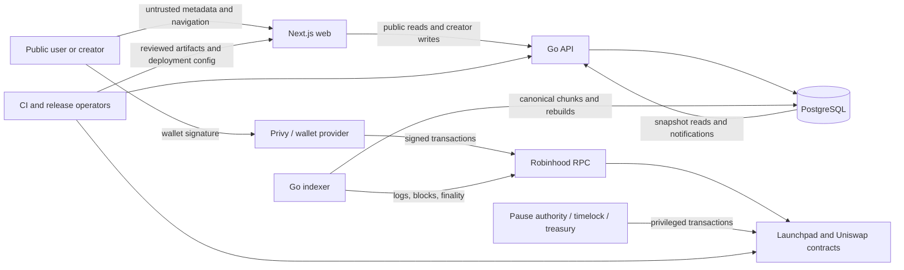

# Repository Security Threat Model

> This document is a reusable, source-backed threat model for the Launchpad repository. It
> describes hypotheses and review priorities, not confirmed vulnerabilities. Plan 5 validates
> or rejects those hypotheses before any remediation is authorized.

**Baseline:** implementation revision `6184bc5febd43de99ab6cc2b6f71f7f90c878bb6`

**Scope:** first-party Solidity contracts, Go API/indexer and PostgreSQL persistence, Next.js
web client and wallet flows, generated artifacts, deployment tooling, CI, and release gates.
Vendored dependencies are supply-chain inputs, not first-party code-quality review scope.

## 1. Overview

Launchpad is a non-custodial fixed-supply token launchpad. A creator launches a token through
`LaunchFactory`; users buy and sell against `BondingCurveV1`; graduation creates and seeds a
Uniswap v2 pair and burns the initial LP position. The browser signs writes through the user's
wallet. The Go indexer reads chain data into a canonical PostgreSQL ledger and rebuildable
projections. The Go API serves snapshot-bound reads and uses Privy tokens plus verified linked
wallets for creator-only metadata writes.

| Component | Security-relevant role | Source evidence |
| --- | --- | --- |
| `LaunchFactory` | Creates token/curve instances, collects launch fees, snapshots launch configuration, and separates pause authority from timelocked configuration | `contracts/src/LaunchFactory.sol:51`, `contracts/src/LaunchFactory.sol:76`, `contracts/src/LaunchFactory.sol:135`, `contracts/src/LaunchFactory.sol:148`, `contracts/src/LaunchFactory.sol:160` |
| `BondingCurveV1` and `CurveMath` | Custodies curve ETH/tokens, prices trades, accrues fees/refunds, and performs graduation | `contracts/src/BondingCurveV1.sol:37`, `contracts/src/BondingCurveV1.sol:89`, `contracts/src/BondingCurveV1.sol:110`, `contracts/src/BondingCurveV1.sol:147`, `contracts/src/BondingCurveV1.sol:370`, `contracts/src/libraries/CurveMath.sol:73` |
| Indexer | Reads `latest`, `safe`, and `finalized`, owns one deployment writer, persists chunks atomically, and recovers from reorgs | `backend/internal/chain/rpc.go:62`, `backend/internal/indexer/engine.go:54`, `backend/internal/indexer/engine.go:243`, `backend/internal/indexer/reorg.go:16`, `backend/internal/store/postgres/ownership.go:33` |
| PostgreSQL store | Holds canonical blocks/events, projections, metadata, ownership state, and aggregation work | `backend/internal/store/postgres/migrations/00003_event_ledger.sql:1`, `backend/internal/store/postgres/migrations/00004_chain_projections.sql:1`, `backend/internal/store/postgres/tx.go:15`, `backend/internal/store/postgres/metadata.go:24` |
| API and identity | Applies HTTP limits/CORS, verifies Privy credentials and linked wallets, serves snapshot-bound reads, and authorizes creator writes | `backend/internal/apiserver/server.go:16`, `backend/internal/apiserver/server.go:26`, `backend/internal/apiserver/server.go:157`, `backend/internal/privyauth/verifier.go:59`, `backend/internal/apiserver/metadata_routes.go:212` |
| Web client | Validates reviewed public configuration, distinguishes wallet readiness and chain state, simulates exact writes, and tracks mined/indexed/finality state | `web/src/config/public.ts:45`, `web/src/config/public.ts:89`, `web/src/wallet/readiness.ts:46`, `web/src/transactions.ts:36`, `web/src/transactions.ts:183` |
| CI and release tooling | Pins toolchain actions, runs contract/backend/web gates, enforces generated-artifact drift checks, and composes the cross-stack Anvil gate | `.github/workflows/contracts.yml:29`, `.github/workflows/backend.yml:59`, `.github/workflows/web.yml:51`, `.github/workflows/release.yml:53`, `scripts/verify-release.mjs:109` |

### Effective sensitive resources

| Deployment or workflow | Resource or capability | Configuration and precedence | Safe effective value or location | Readers, writers, or recipients | Enforcing control | Evidence or unknowns |
| --- | --- | --- | --- | --- | --- | --- |
| API and indexer | PostgreSQL authority | `DATABASE_URL` environment value | Secret manager at deployment; never a public/client variable | API, indexer, migration process | URL validation and separate explicit migration command | `backend/internal/config/config.go:56`, `backend/internal/config/config.go:122`; production secret manager and database roles remain unknown |
| API | Privy verification authority | `PRIVY_APP_ID` and `PRIVY_VERIFICATION_KEY` | Backend-only secret configuration | API verifier | ES256 verification plus linked-wallet parsing | `backend/internal/config/config.go:57`, `backend/internal/config/config.go:58`, `backend/internal/privyauth/verifier.go:59`; production Privy setup remains external |
| Browser | Public chain, API, RPC, and deployment selection | `NEXT_PUBLIC_*` variables are matched against reviewed generated deployments | Public values only; fail closed if manifest/configuration is incomplete | Browser and wallet stack | Reviewed-manifest match and release validation | `web/src/config/public.ts:89`, `web/src/config/public.ts:96`, `web/src/config/public.ts:100`, `web/src/config/release.ts:14`; chain-46630 manifest remains external |
| API/indexer local E2E | Optional deployment-manifest overlay | `DEPLOYMENT_MANIFEST_PATH` selects `LoadEmbeddedWithManifest`; otherwise embedded reviewed manifests are used | Ephemeral manifest created by the authoritative local Foundry deployment; not a mutable production override | API and indexer startup | Schema/registry validation; intended local-only use is documented in code | `backend/cmd/api/main.go:102`, `backend/cmd/indexer/main.go:154`, `backend/deployments/registry.go:54`; production enforcement of the local-only intent requires validation |
| Indexer | Single-writer authority | `CHAIN_ID`, `DEPLOYMENT_ID`, `DATABASE_URL`, `INDEXER_WORKER_ID` | Dedicated PostgreSQL advisory-lock session | One indexer instance per chain/deployment | Session advisory lock; ownership loss is terminal | `backend/internal/store/postgres/ownership.go:33`, `backend/internal/indexer/health.go:84`; production failover policy remains unknown |
| Contract governance | Pause, future configuration, and treasury authority | Constructor values and later on-chain governance calls | Independently controlled pause authority, timelock, and treasury | Designated signers/contracts | Explicit caller checks and immutable per-launch snapshots | `contracts/src/LaunchFactory.sol:51`, `contracts/src/LaunchFactory.sol:148`, `contracts/src/LaunchFactory.sol:160`, `contracts/src/LaunchFactory.sol:179`; signer custody and timelock policy remain external |
| Metadata publication | Token description, links, and image bytes | Authenticated API request with `If-Match` revision | PostgreSQL rows and bounded image bytes | Public readers; verified creator writers | Credential verification, linked-wallet authorization, optimistic concurrency, content checks | `backend/internal/apiserver/metadata_routes.go:143`, `backend/internal/apiserver/metadata_routes.go:160`, `backend/internal/apiserver/metadata_routes.go:212`, `backend/internal/apiserver/metadata_routes.go:260` |
| Release | Build/deployment variables and optional archive RPC secret | GitHub variables/secrets and explicit `--target` | GitHub environment/secret store; no secret in generated web bundle | CI jobs and release operator | Read-only workflow permissions, pinned actions, fail-closed target selection | `.github/workflows/release.yml:21`, `.github/workflows/release.yml:40`, `scripts/verify-release.mjs:22`, `scripts/verify-release.mjs:119`; production environment protection is unknown |

## 2. Threat Model, Trust Boundaries, and Assumptions

### Protected assets

- ETH, launch tokens, accrued creator/protocol fees, refunds, and the burned initial LP
  position.
- Correct curve economics: fixed supply, fee split, graduation threshold, reserve accounting,
  slippage, deadline, and refund behavior.
- Governance authority: pause, engine/default configuration, treasury selection, and deployment
  manifests.
- User intent: selected account, chain, target contract, call arguments, ETH value, minimum
  output, deadline, and receipt/finality state.
- Canonical chain history and the integrity of projections, aggregates, cursors, and API
  snapshots across reorgs.
- Creator identity and metadata ownership, Privy verification material, database credentials,
  private RPC credentials, CI secrets, and operator signing keys.
- Availability of the contracts, RPC ingestion, API, PostgreSQL, notification workers, and web
  client under bounded hostile input.
- Release integrity: ABI, vector, deployment, OpenAPI, migration, generated client, dependency,
  and executable provenance.

### Actors and attacker capabilities

- An unauthenticated Internet client can call public API routes, open SSE connections, submit
  malformed query/cursor/address data, and render public token metadata. It does not begin with
  database, Privy, operator, or CI authority.
- A token creator controls token name/symbol and later creator-authorized description, image,
  and social-link inputs. Creator authority over one token must not become script execution,
  server-side request authority, or control of another token.
- An on-chain participant can deploy contracts, trade, choose recipients and deadlines, order or
  front-run transactions subject to chain rules, create high event volume, and attempt boundary
  values. It does not begin with pause, timelock, or treasury authority.
- An RPC provider or network failure can return stale, unavailable, inconsistent, or reorganized
  chain data. Provider trust must not silently replace safe/finalized or canonical-link checks.
- A pull-request author can change repository content but does not automatically possess GitHub
  secrets, protected-branch authority, release approval, or production credentials.
- Operators may make mistakes. Compromise of a production signer, secret manager, deployment
  environment, or dependency publisher is conditional risk, not an assumed attacker starting
  privilege.

### Trust boundaries and security objectives

1. **Wallet to chain:** every signature must preserve the reviewed chain, account, contract,
   value, arguments, slippage, and deadline that were simulated and shown to the user.
2. **Public chain to canonical database:** block linkage, emitter identity, ABI version, event
   order, finality, idempotency, atomic chunks, and rollback/rebuild rules must prevent a fork or
   duplicate log from becoming durable canonical state.
3. **Database to API/web:** a response page must use one canonical snapshot; invalidated cursors
   and reorged observations must not be presented as current or finalized.
4. **Privy identity to creator mutation:** signature verification, audience/application binding,
   linked EVM wallet parsing, token creator ownership, request limits, and revision checks must
   all succeed before mutation.
5. **Untrusted metadata to browser:** stored text, URLs, and images remain inert data; they must
   not execute script, exfiltrate credentials/referrers, or bypass content and size controls.
6. **Configuration to runtime:** unreviewed chain addresses, test fixtures, private endpoints, and
   missing production inputs must fail closed rather than reach transaction-capable builds.
7. **Governance to existing launches:** emergency pause may act immediately, while timelocked
   future settings and treasury changes must not retroactively alter immutable launch economics.
8. **Source to release:** generated artifacts remain reproducible and byte-identical, actions and
   tools stay pinned, secrets stay out of artifacts/logs, and required gates cannot silently skip.
9. **Resource boundaries:** HTTP bodies/headers, pagination, RPC ranges, indexer chunks, retries,
   database work, browser bundles, subprocesses, and external-provider calls have explicit,
   tested limits.
10. **Numeric integrity:** on-chain quantities use checked integer arithmetic, Go `big.Int` or
    PostgreSQL `NUMERIC(78,0)`, and browser `bigint`/decimal strings; no monetary float or unsafe
    aliasing may change value semantics.

### Assumptions, exclusions, and open deployment questions

- The reviewed implementation baseline is immutable revision `6184bc5`; Plan 5 documentation
  commits are not part of that audit target unless explicitly added later.
- External Privy, Robinhood RPC, Uniswap, CoinGecko, hosting, DNS, CDN/WAF, PostgreSQL, secret
  manager, and monitoring controls are evaluated only to the extent their repository-facing
  configuration is inspectable.
- The reviewed chain-46630 deployment manifest, funded acceptance wallets, production Privy
  values, production topology, governance signer set, timelock policy, legal/geo policy, and
  external audit are not present. They remain external prerequisites in `backlog.md`.
- No claim is made that a public RPC endpoint provides confidentiality. Browser-visible
  `NEXT_PUBLIC_*` values are public by construction.
- Compromise of a user's wallet, an authorized governance signer, the repository administrator,
  or the production host is outside the base attacker model; the audit still checks whether
  least privilege, blast-radius limits, and recovery controls reduce their consequences.
- Forum/Memestock is not implemented and is outside this model except as future scope that must
  receive a new persistence, authorization, moderation, and abuse model before implementation.

## 3. Attack Surface, Mitigations, and Attacker Stories

The following are review hypotheses. They become findings only after Plan 5 reproduces or proves
the failing control and calibrates reachability and impact.

| Priority | Scenario and capability gain | Prerequisites | Impact | Existing controls | Required validation or mitigation | Evidence |
| --- | --- | --- | --- | --- | --- | --- |
| Critical | A trade, graduation, refund, or claim accounting flaw lets a public trader remove ETH/tokens beyond their entitlement or permanently strand funds | Reachable contract state and adversarial integer/order sequence | Direct user/protocol fund loss or broken fixed supply | Checked arithmetic, reentrancy guards, slippage/deadline checks, accounting assertions, invariant/vector tests | Re-derive economics from source; adversarial stateful fuzz/invariant review; validate every external-call ordering and graduation boundary | `contracts/src/BondingCurveV1.sol:89`, `contracts/src/BondingCurveV1.sol:110`, `contracts/src/BondingCurveV1.sol:147`, `contracts/src/BondingCurveV1.sol:370`, `contracts/src/libraries/CurveMath.sol:73` |
| Critical | Unauthorized caller changes engine/default/treasury state, pauses trading, or substitutes an unreviewed deployment | Authorization or manifest boundary failure | Protocol control, malicious future launches, redirected fees, or broad denial of service | Separate pause authority/timelock checks, launch snapshots, reviewed-manifest fail-closed configuration | Trace every privileged caller and deployment transition; verify multisig/timelock and manifest evidence when available | `contracts/src/LaunchFactory.sol:148`, `contracts/src/LaunchFactory.sol:160`, `contracts/src/LaunchFactory.sol:179`, `web/src/config/public.ts:96` |
| High | A mutable or mis-scoped `DEPLOYMENT_MANIFEST_PATH` substitutes an otherwise schema-valid deployment for API/indexer startup | Ability to alter process environment or the referenced file without equivalent release review | Wrong-contract indexing and API state bound to an unreviewed deployment | Exact registry lookup; code comments describe the overlay as isolated local E2E only | Prove production startup cannot enable the overlay, bind the accepted file digest to release evidence, and verify file ownership/immutability | `backend/cmd/api/main.go:102`, `backend/cmd/indexer/main.go:154`, `backend/deployments/registry.go:54` |
| High | Reviewed manifest addresses are accepted without verifying deployed bytecode on a runtime path | Incorrect chain, stale deployment, replaced local node state, or operational misconfiguration | Indexing or serving data for contracts that do not implement the reviewed system | `VerifyDeploymentBytecode` exists and release artifacts carry expected code hashes | Establish whether release-only verification is sufficient; repository search found no API/indexer startup caller, so validate and either document the boundary or wire fail-closed verification | `backend/internal/chain/verify.go:18`, `backend/cmd/api/main.go:49`, `backend/cmd/indexer/main.go:46` |
| High | Pair-init-code validation changes a live external factory by creating a probe pair when `pairCodeHash()` is unavailable | Validation script is executed as a broadcast/live transaction against a compatible factory without the view helper | Unintended state change, cost, collision, or false operational assurance | Expected CREATE2 address is checked; direct helper path uses `staticcall` | Prove the fallback is simulation/fork-only or redesign validation to remain read-only for live release workflows | `contracts/script/deployment/DeploymentValidation.sol:127`, `contracts/script/deployment/DeploymentValidation.sol:140` |
| High | Reorg, provider equivocation, duplicate/out-of-order logs, or lost writer ownership produces a false canonical ledger or unreconciled aggregate | Hostile/failed RPC or concurrent indexers | Incorrect balances, charts, API finality, claims presentation, and analytics | Safe/finalized tracking, block links, session advisory lock, atomic chunks, rollback/rebuild path | Prove deep/shallow reorg behavior, ownership-loss timing, restart recovery, dirty-work backstop, and differential projection equality | `backend/internal/chain/rpc.go:62`, `backend/internal/indexer/engine.go:54`, `backend/internal/indexer/reorg.go:16`, `backend/internal/store/postgres/ownership.go:33` |
| High | Forged or mis-bound Privy material or linked-wallet parsing authorizes metadata writes for another creator/token | Public API access plus verifier/ownership flaw | Unauthorized public content publication and creator impersonation | ES256 signature validation, linked-account validation, database creator lock, `If-Match` revisions | Verify issuer/audience/app binding, token-pair semantics, parser ambiguity, duplicate wallets, key rotation/failure, and cross-token authorization | `backend/internal/privyauth/verifier.go:59`, `backend/internal/privyauth/verifier.go:161`, `backend/internal/store/postgres/metadata.go:92` |
| High | UI signs a call different from the displayed/simulated intent or routes it to the wrong chain/address | Compromised state transition, stale quote, or configuration mismatch | User fund loss or unintended approval/trade | Wallet readiness guard, reviewed deployment lookup, exact intent comparison, explicit transaction states | Trace launch/buy/sell/approve/claim from form state through simulation to wallet request; adversarially mutate account, chain, quote, deadline, and allowance between stages | `web/src/wallet/readiness.ts:46`, `web/src/transactions.ts:87`, `web/src/transactions.ts:132`, `web/src/transactions.ts:183` |
| Medium | Malicious metadata executes active content, leaks navigation/referrer data, abuses an image parser, or overwrites concurrent creator edits | Creator authority over one token or legacy on-chain strings | Browser compromise, phishing, stored content abuse, or data corruption | HTTPS URL checks, image signature/size checks, CSP, no-referrer image policy, ETags | Inspect every rendering sink and redirect; test SVG/HTML/polyglot, Unicode, oversized/decompression, CSP, and stale-write cases | `backend/internal/apiserver/metadata_routes.go:143`, `backend/internal/apiserver/metadata_routes.go:173`, `backend/internal/apiserver/metadata_routes.go:260`, `web/src/security/headers.ts:38` |
| Medium | The local E2E RPC forwarding route becomes a public server-side request/relay surface in a misbuilt deployment | `NEXT_PUBLIC_E2E_FIXTURE=1` and an operator-selected upstream endpoint reach production | Requests from the deployed server to an unintended endpoint and abuse of its RPC authority | Route returns unavailable unless fixture mode and an endpoint are both configured; production release validation is intended to reject fixture mode | Prove build/deployment isolation, allowed method/body limits, upstream restrictions, and that production artifacts cannot enable the route | `web/app/e2e/rpc/route.ts:3`, `web/src/config/public.ts:45`, `web/src/config/release.ts:29` |
| Medium | Unbounded API/SSE/RPC/indexer/database work lets a public or on-chain actor exhaust shared resources | Public endpoints or high-volume chain activity | Availability loss and delayed finality | HTTP/body/header limits, pagination bounds, indexer chunking, RPC range controls, CI timeouts | Establish request/concurrency/cardinality budgets; load-test realistic worst cases; inspect cancellation, retry, pool, query-plan, and fan-out behavior | `backend/internal/apiserver/server.go:26`, `backend/internal/apiserver/server.go:103`, `backend/internal/indexer/engine.go:243`, `scripts/verify-release.mjs:54` |
| Medium | Dependency, generated-artifact, or CI workflow compromise changes released behavior without a reviewed source change | Malicious package/action/tool update or drift-gate gap | Build compromise, wallet/API behavior change, or secret exposure | Lockfiles, pinned actions/tool versions, byte-identical generators, read-only workflow token, composed release gate | Audit dependency reachability and advisories, package scripts, action pinning, submodules, caches, permissions, artifact provenance, and path-filter coverage | `.github/workflows/backend.yml:28`, `.github/workflows/contracts.yml:20`, `.github/workflows/web.yml:26`, `.github/workflows/release.yml:21`, `scripts/verify-release.mjs:132` |
| Medium | Secrets or private endpoints enter browser bundles, logs, error payloads, generated files, test artifacts, or CI output | Misconfiguration or error-path serialization | Credential theft and unauthorized provider/database use | Public/private config split, telemetry redaction, bundle secret scan, `persist-credentials: false` | Use synthetic canaries to test every build/log/error path; inspect source maps and workflow output without accessing real secrets | `backend/internal/config/config.go:55`, `web/src/security/logging.ts:1`, `.github/workflows/backend.yml:60`, `web/package.json:28` |
| Low | Stale or internally inconsistent public views mislead users without enabling a direct write | Reorg, cache, cursor, or snapshot bug | Incorrect UX/analytics and unsafe user decisions | Snapshot/finality fields, REST refetch after invalidation, no optimistic canonical mutation | Differentially test cursor invalidation, cache headers, mined/indexed/safe/finalized transitions, and restart state | `web/src/transactions.ts:36`, `web/src/security/headers.ts:66`, `backend/internal/apiserver/server.go:103` |
| Low/Medium | A reorg deeper than the fixed 128-candidate ancestor search cannot recover automatically | Network/provider history divergence beyond the search window | Indexer halt and operator recovery risk; corruption only if failure is mishandled | Search fails rather than inventing an ancestor; safe-head violations are terminal | Confirm chain/provider guarantees, verify fail-closed behavior, and document/test manual recovery from a deeper divergence | `backend/internal/indexer/reorg.go:31`, `backend/internal/indexer/engine.go:16` |

## 4. Severity Calibration

| Severity | Launchpad-specific threshold | Examples | Counterexamples or downgrade conditions |
| --- | --- | --- | --- |
| Critical | Practical theft/loss of contract-held assets, arbitrary mint/supply break, or unauthorized protocol-wide governance/release control | Publicly reachable reserve-accounting exploit; bypass of timelock authority that redirects future treasury; released malicious contract address accepted as reviewed | Requires prior control of the exact authorized timelock multisig with no new capability; impossible state excluded by constructor and deployment proof |
| High | Cross-user/cross-token authorization bypass, durable canonical corruption that affects balances or transaction decisions, or wallet intent substitution with material asset risk | Forged creator authorization; reorg permanently poisons balances; simulated call differs from signed target/value | Self-only metadata damage; stale display corrected before any write; provider inconsistency rejected before persistence |
| Medium | Meaningful availability, confidentiality, integrity, or supply-chain weakness with realistic prerequisites but no demonstrated direct fund-loss path | Public resource exhaustion; secret in CI logs; stored metadata bypass with constrained impact; exploitable dependency reachable in production | Development-only tool with no release path; advisory in an unused optional dependency; bounded request rejected before expensive work |
| Low | Limited-scope hardening or correctness weakness with small impact and no credible privilege gain | Minor information exposure, bounded stale UI, missing defense in depth | Style, naming, speculative refactor, test-only fixture behavior, or an attacker performing an action they are already authorized to perform |

Impact and confidence are separate. Missing production topology, signer policy, or external service
evidence lowers confidence or makes a scenario conditional; it does not automatically lower the
impact if the prerequisite is later established. Conversely, a scanner label or dependency CVSS
does not determine repository severity without reachable source-to-sink evidence.
